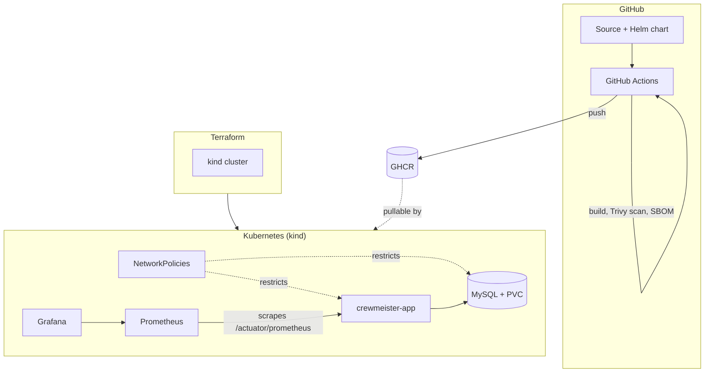

# Crewmeister DevOps Challenge

A small Spring Boot user-management API, taken from a bare, three-endpoint
starting point to a fully containerized, security-scanned, Kubernetes-native
deployment — built, tested, and shipped entirely through automation, and
runnable end-to-end on a laptop with a single command.

## What's actually in here

- A **Docker image** that's multi-stage, runs as a non-root numeric UID,
  caches dependency layers separately from source changes, and ships a
  container-level healthcheck.
- A **Helm chart** deploying the app and MySQL as independent
  Deployment/Service pairs, with:
  - Credentials pulled from a Kubernetes `Secret`, never hardcoded in values
  - A `PersistentVolumeClaim` so MySQL data survives pod restarts
  - CPU/memory resource requests and limits
  - A hardened pod `securityContext` — non-root, `readOnlyRootFilesystem`,
    all Linux capabilities dropped, `allowPrivilegeEscalation: false`
  - Liveness and readiness probes wired to Spring Actuator's health groups
  - `NetworkPolicy` objects restricting the app to only reach MySQL on 3306
    (plus DNS), and MySQL to only accept connections from the app
- **Terraform** provisioning a local `kind` (Kubernetes-in-Docker) cluster —
  free, requires no cloud account, and structured so the same Helm chart
  would deploy unmodified against a real cluster.
- A **GitHub Actions pipeline** that on every push: spins up a real MySQL
  service container and runs the full test suite against it, builds the
  Docker image, scans it with Trivy, generates a CycloneDX software bill of
  materials via syft, and pushes the image to GitHub Container Registry.
- **Prometheus + Grafana** (via `kube-prometheus-stack`), scraping the app's
  existing `/actuator/prometheus` endpoint, with resource limits specifically
  tuned down from the chart's cloud-scale defaults so it runs cleanly
  alongside everything else on a single laptop.
- A **one-command setup script** (`scripts/setup.sh`) that brings the entire
  stack up from a completely fresh clone — no manual steps, no assumed
  state — and a companion `install-tools.sh` that detects the host OS and
  installs whatever's missing (Docker, kind, kubectl, Helm, Terraform).

## Architecture

## The bug that was actually there

The original `GET /user?id=<id>` endpoint called `userRepository.findById(id)`,
which returned a bare `User` — not an `Optional<User>` — and immediately
called `.getName()` on it. For any ID not in the database, that's a
`NullPointerException` surfaced to the caller as a raw 500 with a stack
trace. The original `POST /user` had a matching issue: it parsed the request
body manually with a raw `ObjectMapper` and swallowed exceptions into a
plain-text "Error parsing JSON" response instead of a real HTTP status.

Both were fixed properly rather than patched around: `UserRepository` now
extends `CrudRepository` and returns `Optional<User>`; the controller uses
that `Optional` to return a real `404` with a message, and `POST` now takes
a typed `record` request body that Spring deserializes automatically instead
of a hand-rolled parser.
