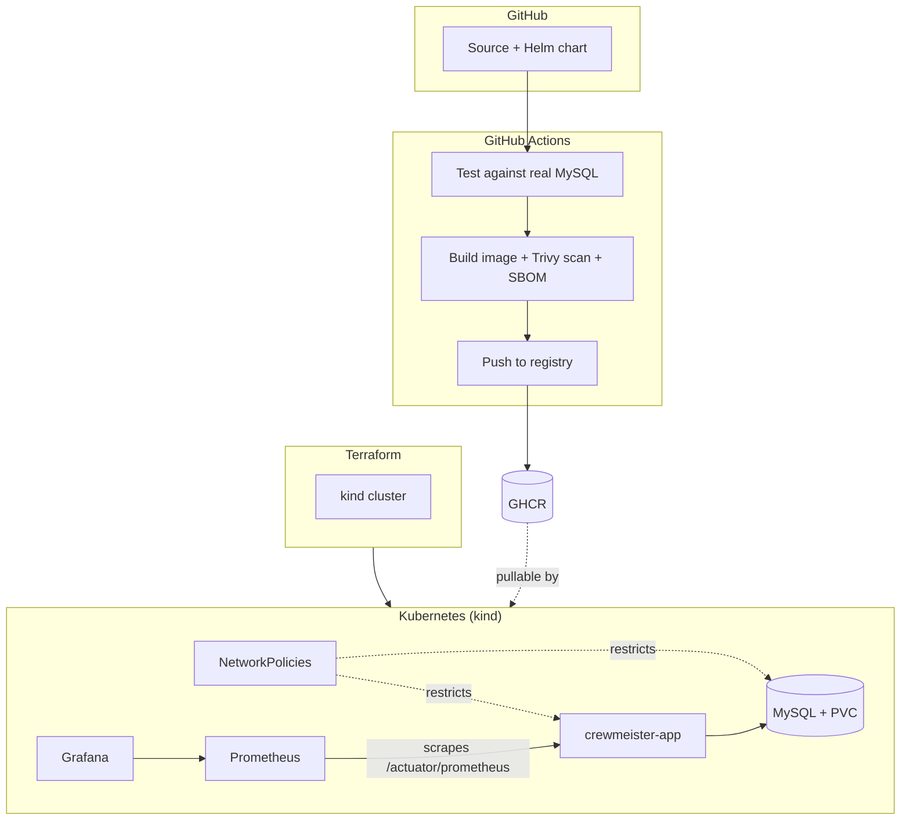

# Crewmeister DevOps Challenge

A small Spring Boot user-management API, taken from a bare, three-endpoint
starting point to a fully containerized, security-scanned, Kubernetes-native
deployment — built, tested, and shipped entirely through automation, and
runnable end-to-end on a laptop with a single command.


## What's actually in here

- A **Docker image** that's multi-stage, runs as a non-root numeric UID,
  caches dependency layers separately from source changes, and ships a
  container-level healthcheck.
- A **Helm chart** deploying the app and MySQL as independent
  Deployment/Service pairs, with:
  - Credentials pulled from a Kubernetes `Secret`, never hardcoded in values
  - A `PersistentVolumeClaim` so MySQL data survives pod restarts
  - CPU/memory resource requests and limits
  - A hardened pod `securityContext` — non-root, `readOnlyRootFilesystem`,
    all Linux capabilities dropped, `allowPrivilegeEscalation: false`
  - Liveness and readiness probes wired to Spring Actuator's health groups
  - `NetworkPolicy` objects restricting the app to only reach MySQL on 3306
    (plus DNS), and MySQL to only accept connections from the app
- **Terraform** provisioning a local `kind` (Kubernetes-in-Docker) cluster.
- A **GitHub Actions pipeline** that on every push: spins up a real MySQL
  service container and runs the full test suite against it, builds the
  Docker image, scans it with Trivy, generates a CycloneDX software bill of
  materials via syft, and pushes the image to GitHub Container Registry.
- **Prometheus + Grafana** (via `kube-prometheus-stack`), scraping the app's
  existing `/actuator/prometheus` endpoint, with resource limits tuned down
  from the chart's cloud-scale defaults so it runs cleanly on a laptop.
- A **one-command setup script** (`scripts/setup.sh`) that brings the entire
  stack up from a completely fresh clone, and a companion
  `install-tools.sh` that detects the host OS and installs whatever's
  missing (Docker, kind, kubectl, Helm, Terraform).

## Architecture



## Approach

The challenge explicitly allows any cloud provider while also requiring the
solution to run seamlessly on a local machine, with everything free to use.
That combination pointed toward one clear choice for the base platform:
**[kind](https://kind.sigs.k8s.io/)**, Kubernetes running as a set of Docker
containers on the local machine. It costs nothing, needs no cloud account or
credentials to review, and — because the deployment layer is a standard
Helm chart with no `kind`-specific assumptions baked in — the exact same
chart deploys unmodified to a real cluster (EKS, GKE, a self-managed
cluster) the moment an image is sitting in a registry it can reach. `kind`
was the way to satisfy "runs locally" without weakening the "cloud-capable"
half of the requirement.

Each other tool was chosen to do exactly one job, and only that job:

- **Docker** builds one image. Nothing about deployment or orchestration
  belongs in it.
- **Helm** describes what "correctly deployed" means — resource shape,
  security posture, networking — independent of what created the cluster
  it's deployed into.
- **Terraform** owns only the cluster's existence, not the application
  release. Locally, the app image has to be manually loaded into `kind`
  before anything can run it; asking Terraform's `helm_release` to also
  install and wait on the app in the same `apply` creates a race between
  "cluster exists" and "image is loadable" that Terraform has no clean way
  to resolve. Splitting the two — Terraform for the cluster,
  a plain `helm upgrade --install` afterward in `scripts/setup.sh` — removes
  the race entirely and keeps each tool doing the one thing it does best.
- **GitHub Actions** is where correctness and security get verified
  automatically, on a machine that starts from nothing every run — not
  something left to be checked by hand on a laptop that's already primed
  with cached layers, installed tools, and leftover state.

The result is a set of small, single-purpose layers instead of one large
tool trying to do everything, which is also why extending this later — a
real registry push, a different Kubernetes target, a GitOps controller
managing the Helm release instead of a script — is a change to one layer,
not a rewrite of the whole thing.

## A CVE that three version bumps didn't fix — and why

Trivy's scan gate kept flagging `jackson-databind` as vulnerable, no matter
how many times the Spring Boot version was bumped — first to `3.3.11`, then
to `3.5.14`, each time expecting the CVE to disappear along with everything
else it fixed. It didn't. The reason turned out to have nothing to do with
Spring Boot's own release cadence: `pom.xml` had a leftover, explicit
`<version>2.15.0</version>` pinned directly on the `jackson-databind`
dependency, silently overriding whatever version Spring Boot's own dependency
management BOM was trying to supply. No amount of parent-version bumping was
ever going to touch it.

The actual fix was two-fold: removing that hardcoded pin so Spring Boot's BOM
controls the version, and adding a small set of targeted property overrides
(`tomcat.version`, `spring-framework.version`, `spring-data-bom.version`,
`micrometer.version`, `jackson-bom.version`) in `pom.xml` for the handful of
libraries where Spring Boot's own latest patch release hadn't yet caught up
to an already-published upstream fix. That combination took the image from
32 HIGH/CRITICAL findings down to a small number that genuinely require a
Spring Boot 4.0 migration — an 80-plus breaking-change upgrade that Spring's
own community guidance estimates at 200-500 engineering hours, and which
Spring Boot 3.5 itself only just aged out of support for (open-source EOL:
June 30, 2026). Trivy's scan step is deliberately left non-blocking
(`exit-code: 0`) so those remaining, documented findings stay visible on
every build without holding up unrelated work.

## NetworkPolicies that exist, and are honest about not doing anything locally

`NetworkPolicy` is a standard Kubernetes object, but it's only as good as
the CNI plugin underneath it — and `kind`'s default CNI (kindnet) accepts
`NetworkPolicy` resources without enforcing a single one of them. The
policies restricting app↔MySQL traffic in this chart are written and applied
regardless, because they're portable: the exact same YAML becomes fully
enforced the moment this chart is deployed to a cluster running Calico,
Cilium, or the built-in network policy support most managed cloud
Kubernetes offerings ship with. Rather than either skip them or quietly
pretend they're doing something on `kind`, the chart includes them and the
limitation is stated plainly here.

## Getting monitoring to actually stay up

`kube-prometheus-stack`'s default resource settings assume a real cluster's
worth of spare CPU and memory. Installed as-is on a `kind` cluster sharing a
single laptop's resources with everything else in this stack, Grafana's pod
would restart every few minutes — not from a bug, but because its CPU
*limit* was throttling it hard enough that loading its bundled datasource
plugins took over two minutes instead of the usual few seconds, which blew
past the liveness probe's default timeout before Grafana ever had a chance
to answer a health check. The fix wasn't a bigger machine, it was tuning the
chart for what it's actually running on: the CPU *limit* was removed
entirely (keeping only a request, so scheduling stays fair) and the probe's
`initialDelaySeconds` was raised to give slow, CPU-starved startups room to
finish. Alertmanager and the node-exporter were also disabled outright,
since neither adds anything meaningful to a single-node local demo. The full
reasoning and values live in `monitoring/values-local.yaml`.

## Quickstart

```bash
./scripts/install-tools.sh   # installs whatever's missing: docker, kind, kubectl, helm, terraform
./scripts/setup.sh           # builds the image, provisions kind, deploys the app + monitoring
```

```bash
kubectl port-forward svc/crewmeister-app 8080:8080
curl -s -X POST localhost:8080/user -H 'Content-Type: application/json' -d '{"name":"Ada"}'
curl -s "localhost:8080/user?id=1"

kubectl port-forward svc/kube-prometheus-stack-grafana 3000:80 -n monitoring
# http://localhost:3000, login admin/admin
```

For a quick app+database loop without touching Kubernetes at all:
`docker compose up --build`.

Tear down everything: `cd terraform && terraform destroy`.

## Repository layout

```
.
├── Dockerfile / .dockerignore / docker-compose.yml
├── src/                          # Spring Boot app
├── helm/crewmeister-challenge/   # app + mysql, Secret, PVC, NetworkPolicies, hardened securityContext
├── terraform/                    # kind cluster provisioning
├── monitoring/values-local.yaml  # kube-prometheus-stack tuned for local kind
├── scripts/
│   ├── install-tools.sh          # cross-platform tool bootstrap
│   └── setup.sh                  # one-command local bring-up
└── .github/workflows/ci.yml      # test (real MySQL) → build → Trivy → SBOM → push to GHCR
```
