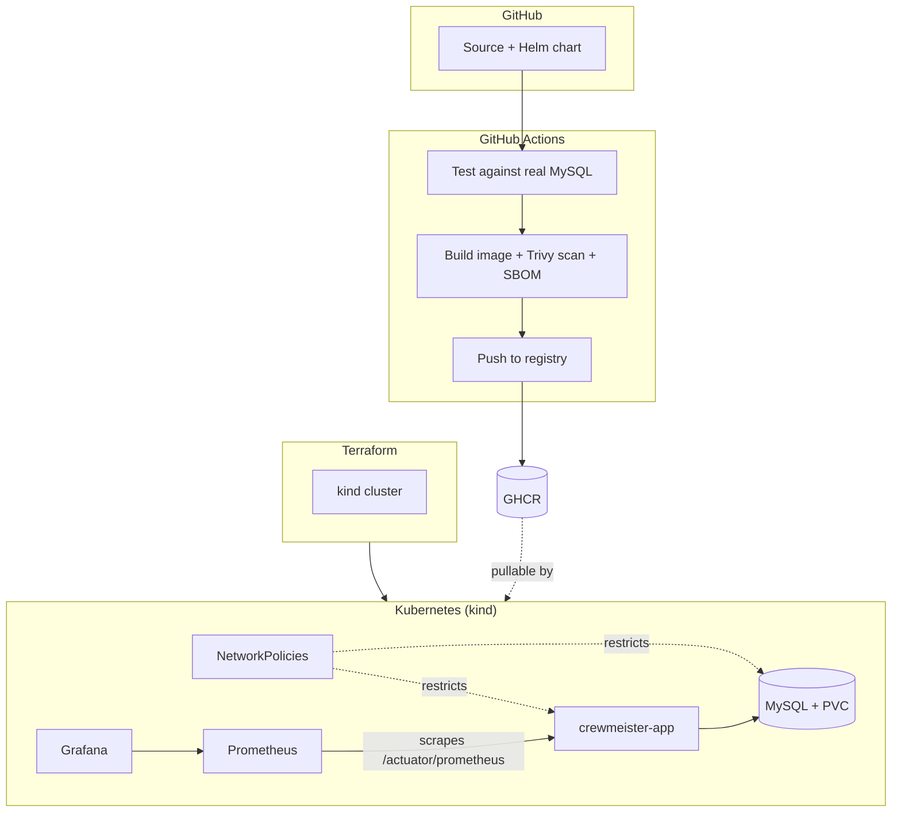

# Crewmeister DevOps Challenge

A small Spring Boot user-management API, taken from a bare, three-endpoint
starting point to a fully containerized, security-scanned, Kubernetes-native deployment - built, tested, and shipped entirely through automation, and runnable end-to-end on a laptop with a single command.

**A note on approach:** the base solution was built to run entirely on
`kind`, so it costs nothing and needs no cloud account to review. On top of that, it was also deployed to a real AWS EKS cluster on my own free-tier account, purely to show I can operate this outside a local sandbox - which meant working directly with IAM, EKS's own version lifecycle, and IRSA, not just running `terraform apply` once and calling it done. The EKS control plane and its NAT gateway aren't free to run, so that path is spun up to
verify, screenshotted, and torn down immediately after - see
[Running this on AWS](#running-this-on-aws) for the full account, including
what went wrong along the way.


## What's actually in here

- A **Docker image** that's multi-stage, runs as a non-root numeric UID, caches dependency layers separately from source changes, and ships a container-level healthcheck.
- A **Helm chart** deploying the app and MySQL as independent
  Deployment/Service pairs, with:
  - Credentials pulled from a Kubernetes `Secret`, never hardcoded in values
  - A `PersistentVolumeClaim` so MySQL data survives pod restarts
  - CPU/memory resource requests and limits
  - A hardened pod `securityContext` - non-root, `readOnlyRootFilesystem`,
    all Linux capabilities dropped, `allowPrivilegeEscalation: false`
  - Liveness and readiness probes wired to Spring Actuator's health groups
  - `NetworkPolicy` objects restricting the app to only reach MySQL on 3306    (plus DNS), and MySQL to only accept connections from the app
- **Terraform** provisioning either a local `kind` (Kubernetes-in-Docker)
  cluster or a real AWS EKS cluster, from the same values-driven Helm chart with no target-specific templates.
- A **GitHub Actions pipeline** that on every push: spins up a real MySQL  service container and runs the full test suite against it, builds the Docker image, scans it with Trivy, generates a CycloneDX software bill of materials via syft, and pushes the image to GitHub Container Registry.
- **Prometheus + Grafana** (via `kube-prometheus-stack`), scraping the app's  existing `/actuator/prometheus` endpoint, with resource limits tuned down from the chart's cloud-scale defaults so it runs cleanly on a laptop.
- A **one-command setup script** (`scripts/setup.sh`) that brings the entire  stack up from a completely fresh clone, and a companion
  `install-tools.sh` that detects the host OS and installs whatever's  missing (Docker, kind, kubectl, Helm, Terraform).

## Architecture



## Approach

The challenge explicitly allows any cloud provider while also requiring the solution to run seamlessly on a local machine, with everything free to use.
That combination pointed toward one clear choice for the base platform:
**[kind](https://kind.sigs.k8s.io/)**, Kubernetes running as a set of Docker containers on the local machine. It costs nothing, needs no cloud account or credentials to review, and because the deployment layer is a standard Helm chart with no `kind`-specific assumptions baked in the exact same chart deploys unmodified to a real cluster (EKS, GKE, a self-managed cluster) the moment an image is sitting in a registry it can reach. `kind`
was the way to satisfy "runs locally" without weakening the "cloud-capable" half of the requirement. That claim is no longer theoretical the same chart has since been deployed unmodified to a real AWS EKS cluster, with only a values override for the load balancer type and image registry (see [Running this on AWS](#running-this-on-aws)).

Each other tool was chosen to do exactly one job, and only that job:

- **Docker** builds one image. Nothing about deployment or orchestration  belongs in it.
- **Helm** describes what "correctly deployed" means resource shape,  security posture, networking — independent of what created the cluster it's deployed into.
- **Terraform** owns only the cluster's existence, not the application release. Locally, the app image has to be manually loaded into `kind` before anything can run it; asking Terraform's `helm_release` to also  install and wait on the app in the same `apply` creates a race between "cluster exists" and "image is loadable" that Terraform has no clean way  to resolve. Splitting the two — Terraform for the cluster,  a plain `helm upgrade --install` afterward in `scripts/setup.sh` removes  the race entirely and keeps each tool doing the one thing it does best.
- **GitHub Actions** is where correctness and security get verified
  automatically, on a machine that starts from nothing every run — not  something left to be checked by hand on a laptop that's already primed with cached layers, installed tools, and leftover state.

The result is a set of small, single-purpose layers instead of one large tool trying to do everything, which is also why extending this later, a real registry push, a different Kubernetes target, a GitOps controller managing the Helm release instead of a script — is a change to one layer, not a rewrite of the whole thing.

## NetworkPolicies that exist, and are honest about not doing anything locally

`NetworkPolicy` is a standard Kubernetes object, but it's only as good as
the CNI plugin underneath it — and `kind`'s default CNI (kindnet) accepts
`NetworkPolicy` resources without enforcing a single one of them. The
policies restricting app↔MySQL traffic in this chart are written and applied
regardless, because they're portable: the exact same YAML becomes fully
enforced the moment this chart is deployed to a cluster running Calico,
Cilium, or the built-in network policy support most managed cloud
Kubernetes offerings ship with. Rather than either skip them or quietly
pretend they're doing something on `kind`, the chart includes them and the
limitation is stated plainly here.

## Getting monitoring to actually stay up

`kube-prometheus-stack`'s default resource settings assume a real cluster's
worth of spare CPU and memory. Installed as-is on a `kind` cluster sharing a
single laptop's resources with everything else in this stack, Grafana's pod
would restart every few minutes — not from a bug, but because its CPU
*limit* was throttling it hard enough that loading its bundled datasource
plugins took over two minutes instead of the usual few seconds, which blew
past the liveness probe's default timeout before Grafana ever had a chance
to answer a health check. The fix wasn't a bigger machine, it was tuning the
chart for what it's actually running on: the CPU *limit* was removed
entirely (keeping only a request, so scheduling stays fair) and the probe's
`initialDelaySeconds` was raised to give slow, CPU-starved startups room to
finish. Alertmanager and the node-exporter were also disabled outright,
since neither adds anything meaningful to a single-node local demo. The full
reasoning and values live in `monitoring/values-local.yaml`.

## Running this on AWS

The same Helm chart above, unmodified, targets a real EKS cluster instead
of `kind` once an image is pushed to a registry it can pull from. This path
lives under `terraform/aws/` and `helm/crewmeister-challenge/values-aws.yaml`,
and is opt-in - it costs real money while running, so it's meant to be
spun up to verify, then torn down, not left running.

What `terraform/aws/` provisions:

- A small two-AZ VPC, with a single NAT gateway instead of one per AZ - a
  deliberate cost tradeoff that would be wrong for production HA, but is
  the right call for a cluster that only needs to exist long enough to be
  reviewed
- An EKS cluster with one managed spot node group (`t3.small`)
- The `coredns`, `kube-proxy`, `vpc-cni`, and `aws-ebs-csi-driver` addons,
  the last wired to its own IAM role via IRSA so it can actually provision
  EBS volumes for MySQL's PVC
- A `StorageClass` marked as cluster default, so the same PVC manifest that
  works unmodified on `kind`'s local-path provisioner gets real EBS-backed
  storage on AWS with no chart changes

```bash
cd terraform/aws
terraform init
terraform apply          # ~15-20 minutes - EKS control plane provisioning is slow by nature

aws eks update-kubeconfig --region eu-central-1 --name crewmeister-challenge

aws ecr create-repository --repository-name crewmeister-challenge --region eu-central-1
aws ecr get-login-password --region eu-central-1 | \
  docker login --username AWS --password-stdin <ACCOUNT_ID>.dkr.ecr.eu-central-1.amazonaws.com
docker build -t <ACCOUNT_ID>.dkr.ecr.eu-central-1.amazonaws.com/crewmeister-challenge:latest .
docker push <ACCOUNT_ID>.dkr.ecr.eu-central-1.amazonaws.com/crewmeister-challenge:latest

cd ../../
helm install crewmeister-challenge ./helm/crewmeister-challenge \
  -f helm/crewmeister-challenge/values-aws.yaml \
  -f helm/crewmeister-challenge/values-aws.local.yaml   # not committed - holds the real DB password

kubectl get svc crewmeister-challenge-app   # EXTERNAL-IP is a real AWS NLB, courtesy of the
                                             # service.beta.kubernetes.io/aws-load-balancer-type: nlb
                                             # annotation - without it EKS defaults to a Classic LB
```

Tear down with `helm uninstall crewmeister-challenge && cd terraform/aws &&
terraform destroy`. Nothing here shuts itself off on a schedule, so this
step isn't optional cleanup - it's the only thing that stops the EKS
control plane, the NAT gateway, and the node from billing indefinitely.

One honest gap, same as locally: EKS's default CNI (`vpc-cni`) doesn't
enforce `NetworkPolicy` out of the box either, unless its network policy
controller is turned on separately. The policies in this chart are still
correct and portable - they're just not doing anything on either target as
shipped.

## What broke while provisioning EKS, and what it means

None of the following was expected going in, and it's worth writing down
rather than editing out of the history:

- **IAM scoping took three iterations to get right.** The deploying IAM
  user started with policies scoped to exactly what EKS/VPC/EC2
  documentation says is needed, and still failed three separate times -
  once on `kms:TagResource` (the cluster's encryption key), once on
  `logs:CreateLogGroup` (control plane logging), and once on
  `eks:CreateCluster` itself, which has no single AWS-managed policy that
  grants it to a human/CLI identity. Given the time constraints here, the
  pragmatic fix was `AdministratorAccess` on the deploy user for this
  exercise. A production setup would replace that with a custom policy
  scoped to exactly those actions, or better, a CI role assumed via OIDC
  federation with no standing IAM user at all.
- **EKS 1.30 - the version this was originally built against - reached end
  of extended support on August 31, 2026,** days before this was deployed.
  AWS had already stopped publishing node-group AMIs for it, so the
  control plane created fine but the node group failed with
  `Requested AMI for this version 1.30 is not supported`. EKS only allows
  one minor-version upgrade step at a time, so rather than four sequential
  in-place upgrades, the cluster was destroyed and recreated directly at
  1.34 (in standard support at time of writing). Worth remembering by
  anyone running this later: EKS versions age out on a schedule regardless
  of what a Terraform default says, and that default will eventually need
  bumping again.
- **The EBS CSI driver addon needs its own IAM role, and the module
  doesn't create one for you.** Declaring `cluster_addons.aws-ebs-csi-driver
  = {}` enables the addon but leaves its service account with no AWS
  permissions, so the controller pods fell back to the node's own
  (deliberately narrow) EC2 instance-profile credentials and crash-looped
  on `DescribeAvailabilityZones: not authorized`. The fix was an explicit
  IAM-role-for-service-accounts module, scoped to the
  `ebs-csi-controller-sa` service account via the cluster's OIDC provider,
  wired into the addon through `service_account_role_arn`.
- **Re-annotating the service account didn't fix already-running pods.**
  Kubernetes injects the IRSA identity token at pod creation time, not
  retroactively, so the pods that were already crash-looping from the IAM
  gap kept crash-looping even after the fix landed - Terraform's own
  20-minute wait for the addon to report `ACTIVE` timed out twice because
  of this. `kubectl rollout restart deployment ebs-csi-controller` forced
  new pods that actually picked up the annotation, which is what resolved
  it - not a longer wait.

None of this changed the final chart or Terraform structure much. It did
make clear that "it deploys" and "it deploys correctly the first time" are
different claims, and that the gap between them is mostly a function of how
much of AWS's IAM and version-lifecycle surface you've already hit before.

## Quickstart

```bash
./scripts/install-tools.sh   # installs whatever's missing: docker, kind, kubectl, helm, terraform
./scripts/setup.sh           # builds the image, provisions kind, deploys the app + monitoring
```

```bash
kubectl port-forward svc/crewmeister-app 8080:8080
curl -s -X POST localhost:8080/user -H 'Content-Type: application/json' -d '{"name":"Ada"}'
curl -s "localhost:8080/user?id=1"

kubectl port-forward svc/kube-prometheus-stack-grafana 3000:80 -n monitoring
# http://localhost:3000, login admin/admin
```

For a quick app+database loop without touching Kubernetes at all:
`docker compose up --build`.

Tear down the local stack: `cd terraform/kind && terraform destroy`. For
the AWS path, see [Running this on AWS](#running-this-on-aws) above.

## Repository layout

```
.
├── Dockerfile / .dockerignore / docker-compose.yml
├── src/                          # Spring Boot app
├── helm/crewmeister-challenge/   # app + mysql, Secret, PVC, NetworkPolicies, hardened securityContext
│   ├── values.yaml                    # shared defaults
│   ├── values-aws.yaml                # AWS overrides: LoadBalancer + NLB annotation, ECR image
│   └── values-aws.local.yaml          # not committed - real DB password for the AWS target
├── terraform/
│   ├── kind/                     # local cluster provisioning
│   └── aws/                      # EKS cluster, VPC, IRSA role for the EBS CSI driver
├── monitoring/values-local.yaml  # kube-prometheus-stack tuned for local kind
├── scripts/
│   ├── install-tools.sh          # cross-platform tool bootstrap
│   └── setup.sh                  # one-command local bring-up
└── .github/workflows/ci.yml      # test (real MySQL) → build → Trivy → SBOM → push to GHCR
```